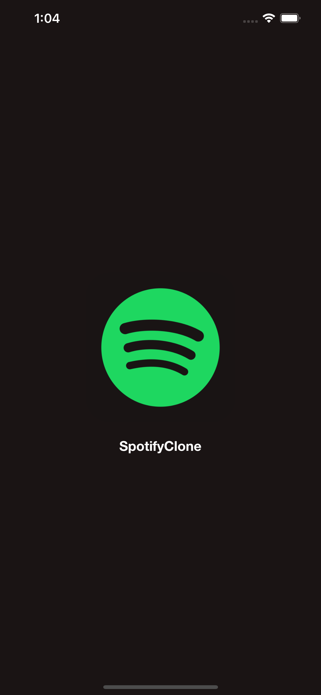
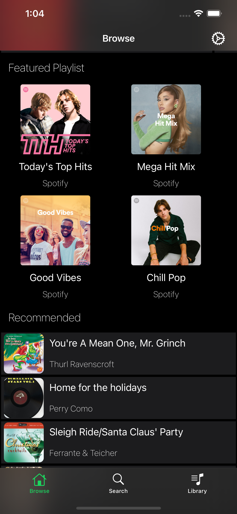
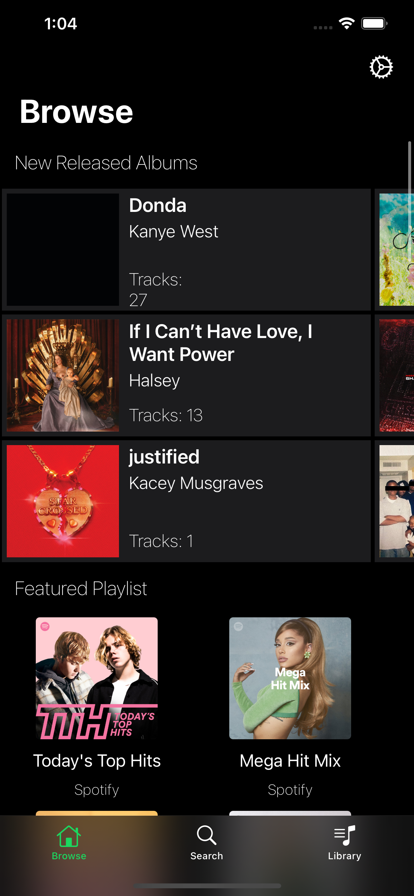
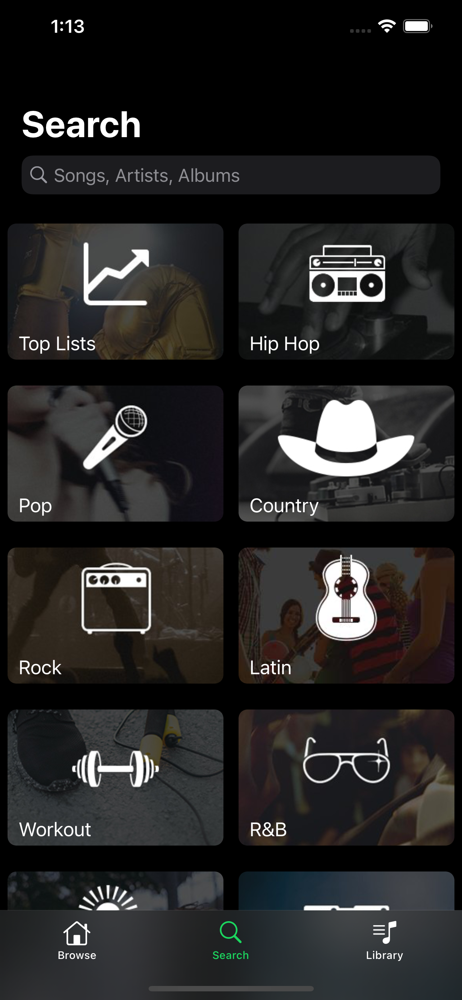
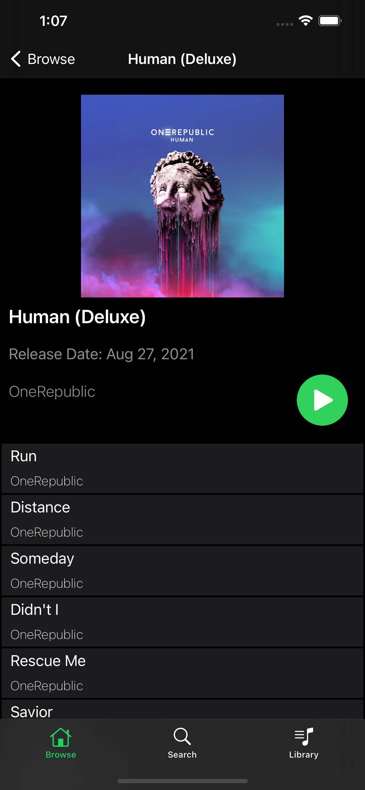
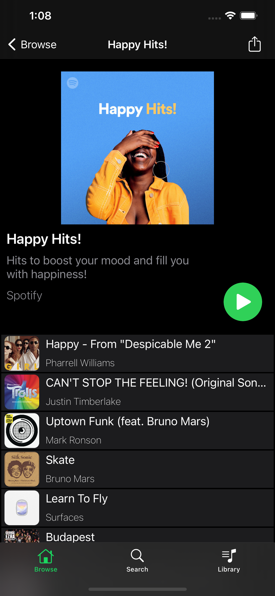
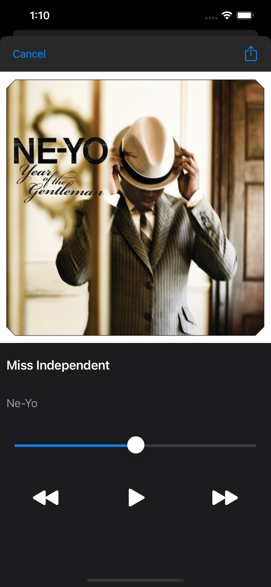
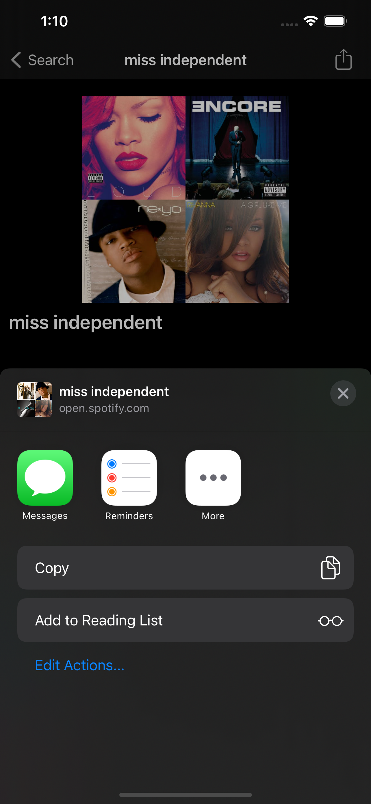
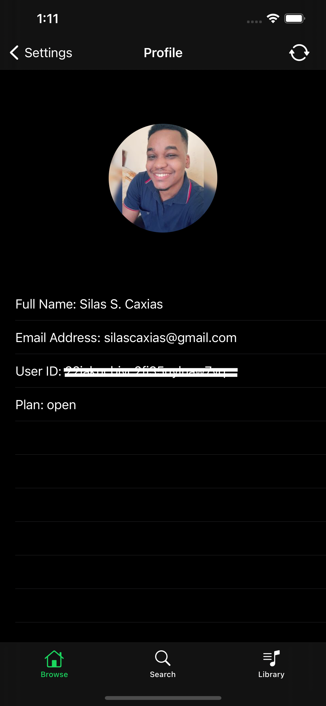

# SpotifyClone

Project in Swift, the objective is to clone the real APP only with native resources and with ViewCode.

## Capturas de Tela

### Splash

### Home / Browse - Album, Playlist e Recommended

 

### Search

### Album

### Playlist

### Song

 

### Profile

